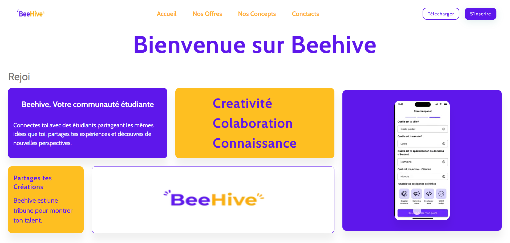

<h1 align="center">
  <a href="https://github.com/bafode/beehive-landing-page">
    🚀 Beehive - Landing Page du Réseau Social Étudiant
  </a>
</h1>

<p align="center">
  
</p>

---

### ✨ Présentation

**Beehive** est un réseau social conçu spécialement pour les étudiants. Cette **landing page** vise à présenter la plateforme et à attirer de nouveaux utilisateurs de manière élégante, moderne et responsive.

Développée avec **Next.js**, **React**, et **Material UI**, elle offre un design léger, facilement personnalisable, et pensé pour une intégration rapide.

---

### 🌐 Démo en ligne

🔗 [Clique ici pour voir la démo en direct](https://beehiveapp.fr/)

---

### 🧰 Technologies utilisées

- ⚛️ React + Next.js
- 🎨 Material UI (MUI)
- ⚡ TypeScript
- 📱 Responsive Design
- 🔧 `sx` prop pour une personnalisation rapide
- 🖼️ Open Graph + Twitter Cards intégrés

---

### ⚙️ Installation & Lancement

> Ce projet a été généré avec [`create-next-app`](https://github.com/vercel/next.js/tree/canary/packages/create-next-app)

```bash
# Installation des dépendances
npm install
# ou
yarn install

# Lancer le serveur local
npm start
# ou
yarn start


<h6>
  <br />
  <p>
   <a href="https://res.cloudinary.com/dbi0fzoml/image/upload/w_1000,c_fill,ar_1:1,g_auto,r_max,bo_5px_solid_red,b_rgb:262c35/v1743583032/ChatGPT_Image_Apr_1_2025_10_15_42_PM_vezcye.png"></a>
  </p>
  <p>
  Designed by
  <p> 
  <a href="https://github.com/bafode">Bafode Camara</a>
</h6>
